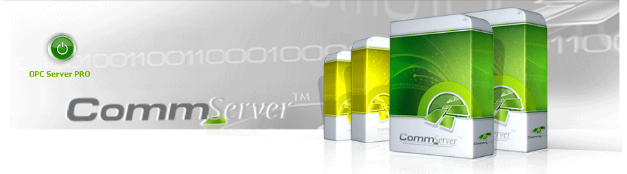

# CommServer software family

## Hi there 👋

## 🙋‍♀️ A short introduction

Welcome to a portal about innovative communication technologies. Here, you can find information about modern solutions in the field of software for communication and integration of computer systems. OPC technology – an international industrial communication standard - is a foundation for the proposed solutions.

CommServer is a software family to manage data transfer. Built-in technologies and algorithms provide an intelligent data transfer that automatically adapts communication parameters to the users or process needs. It is well suited to manage communication between applications, which combine the smart data transfer and systems integration functionality. It is optimally solution for the industrial process control, where the managed process is distributed over a large geographical area, e.g. heat and power distribution, oil and gas distribution, water and sanitation, multi-enterprise production, city road traffic supervision, control of water level and weather conditions, etc.

## 🌈 Contribution guidelines - how can the community get involved?

The CommServer software was written by CAS Lodz Poland. Now it is migrating to GitHub and publishing as the Open-source software (OSS). OSS is a type of computer software in which source code is released under a license in which the copyright holder grants users the rights to study, change, and distribute the software to anyone and for any purpose. The separate project [commsvr-com/migration2os][migration2os] is being used to manage the migration process of transferring multi-parts software from an on-premise repository to a set of GitHub loosely coupled repositories. Further development of CommServer software will be carried out under a broader concept described in the following article

- [OPC UA Makes Machine-Centric Global Village Possible – Call for Sponsors][wordpress.sponsors]

In the article, there is a call to action initiative. Consider joining. To get more, visit the section `How to be involved`.

I hope that thanks to this Partnership Program we will establish long term mutually beneficial cooperation.

In the following tables, the column GitHub contains links to appropriate GitHub repositories. At the top of each repository page, click on the `Watch` button if you want to watch selected projects that you're interested in. After that, you will get notifications about any activity at all on the project! Apparently, it is a signal for me to increase priority for planned work related to this repository.
The family includes the following applications.

| Name | Description  | GitHub |
| - | - | - |
| **OPC UA Address Space Model Designer** | UA Model Designer is a powerful tool, which allows creating, displaying and editing OPC UA models compatible with the OPC Unified Architecture address space concept. The tool is created for developers and engineers, for professionals and beginners. | [mpostol/ASMD][ASMD] |
| **OPC UA Server** | It is a package of communication software to manage data transfer. It’s a fully configurable OPC UA server. It provides a multi-protocol, multi-medium and multi-channel redundant access to physical process control device data. To ensure short response time and effective utilization of the physical device communication channels throughput, a unique scan on demand algorithm was implemented. This OPC UA server can be used to wrap the Classic OPC DA server (DCOM based) and to create the Address Space based on the XML model file obtained from CAS Address Space Model Designer. | [mpostol/OPCUA.Server][OPCUA.Server] |
| **OPC UA Viewer** | CommServer OPC UA Viewer is an OPC Unified Architecture (OPC UA) client. It allows integrators, developers, testers and all other users to easily connect to any OPC UA server, read data from the server, browse model structure according to references and much more! | [mpostol/OPCUA.Viewer][OPCUA.Viewer] |
| **OPC DA Server** | It is an application of communication software to manage data transfer. Built-in technologies and algorithms provide an intelligent data transfer over the wire automatically adapting its parameters to the user’s or process needs. To ensure short response time and effective utilization of the physical device communication channels throughput, a unique scan on demand algorithm was implemented. | [mpostol/OPCDA.Server][OPCDA.Server] |
| **OPC DA Viewer** | It is a full featured OPC client designed to help during installation, testing, and configuration of OPC Data Access compliant servers. | [mpostol/OPCDA.Viewer][OPCDA.Viewer] |
| **OPC DA DataPorter** | It is an independent package of the CommServer software family. It is designed to integrate industrial applications - as an engine to port data between most popular standards. | [mpostol/OPCDA.DataPorter][OPCDA.DataPorter] |

## See also

- [OPC UA Makes Machine-Centric Global Village Possible – Call for Sponsors][wordpress.sponsors]
- [Object-Oriented Internet Partnership Program][AboutPartnershipProgram]
- [CommServer software Migration][Download]
- [CommServer software family - management of the migration to open source; GitHub repository `commsvr-com/migration2os`][migration2os]

[Download]:https://github.com/orgs/commsvr-com/projects
[OPCUA.Viewer]:https://github.com/mpostol/OPCUA.Viewer
[OPCUA.Server]:https://github.com/mpostol/OPCUA.Server
[OPCDA.DataPorter]:https://github.com/commsvr-com/OPCDA.DataPorter
[OPCDA.Server]:https://github.com/commsvr-com/OPCDA.Server
[ASMD]:https://github.com/mpostol/ASMD
[OPCDA.Viewer]:https://github.com/commsvr-com/OPCDA.Viewer
[migration2os]:https://github.com/commsvr-com/migration2os
[wordpress.sponsors]:https://mpostol.wordpress.com/2020/01/03/opc-ua-makes-machine-centric-global-village-possible-call-for-sponsors/
[AboutPartnershipProgram]:https://github.commsvr.com/AboutPartnershipProgram.md.html

<table style="font-size: 11px;" title="Bottom navigation menu" border="0" cellspacing="20" cellpadding="1" align="center">
    <tbody title="CommServer">
        <tr align="center" valign="middle" border="0" >
            <td title="github">
              <a title="GitHub Object Oriented Internet" href="https://github.com/mpostol"  target="_blank" rel="external noopener noreferrer"> 
                
                  GitHub 
              </a>
            </td>
            <td title="wordpress">
              <a title="Open Mariusz Postol Blog" href="http://mpostol.wordpress.com/" target="_blank" rel="external noopener noreferrer">
                
                  Blog 
              </a>
            </td>
            <td title="LinkedIn">
              <a title="Follow Mariusz Postol on LinkedIn" href="https://www.linkedin.com/in/mpostol/" target="_blank" rel="external noopener noreferrer"> 
                
                  LinkedIn 
              </a>
            </td>
            <td title="youtube">
              <a title="Follow us on YouTube" href="https://www.youtube.com/@mariuszpostol/featured" target="_blank" rel="external noopener noreferrer"> 
                 
                  YouTube
              </a>
            </td>
            <td title="researchgate">
              <a title="Follow Mariusz Postol on ResearchGate" 
                 href="https://www.researchgate.net/profile/Mariusz_Postol" target="_blank" rel="external noopener noreferrer"> 
                
                  RG 
              </a>
            </td>
            <td title="twitter">
              <a title="Follow CommServer on Twitter" href="https://twitter.com/mpostol" target="_blank" rel="external noopener noreferrer"> 
                
                  Twitter 
              </a>
            </td>
        </tr>
    </tbody>
</table>

<!--
**Here are some ideas to get you started:**
🌈 Contribution guidelines - how can the community get involved?
👩‍💻 Useful resources - where can the community find your docs? Is there anything else the community should know?
🍿 Fun facts - what does your team eat for breakfast?
🧙 Remember, you can do mighty things with the power of [Markdown](https://docs.github.com/github/writing-on-github/getting-started-with-writing-and-formatting-on-github/basic-writing-and-formatting-syntax)
-->
